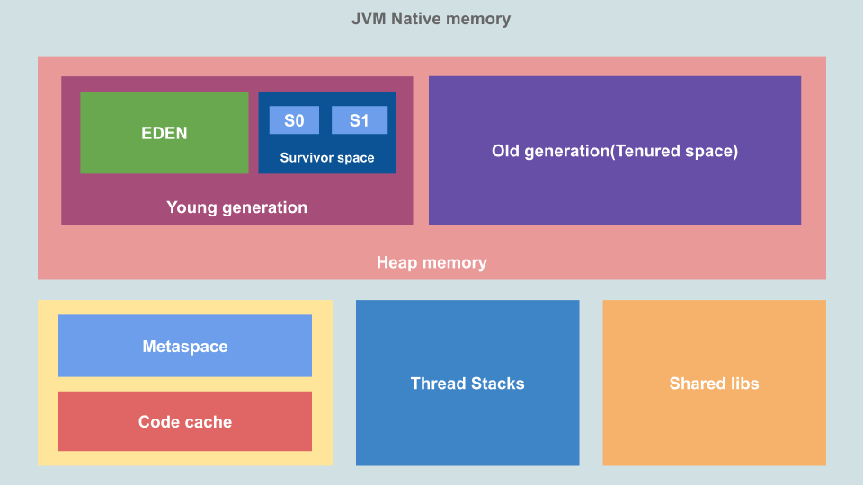

# Java Performance Tuning and GC- Algorithms and SWAP

## JVM Memory

## Garbage Collector

.. cleans up **unreachable** references

Generally follows the principle of:

1. mark/promote
2. sweep
3. compact

### Marking

### Promoting

### Compacting

### Types

| GC Name                        | Description                                         | Key Tuning Flags                                                                                                                      |
|--------------------------------|-----------------------------------------------------|---------------------------------------------------------------------------------------------------------------------------------------|
| Serial GC                      | Single-threaded STW; best for small heaps or tests  | -XX:+UseSerialGC -XX:MaxHeapFreeRatio=<…> -XX:MinHeapFreeRatio=<…>                                                              |
| Parallel (Throughput) GC       | Multi-threaded STW; maximizes overall throughput    | -XX:+UseParallelGC -XX:ParallelGCThreads=<…> -XX:MaxGCPauseMillis=<…> -XX:GCTimeRatio=<…>                                    |
| CMS (Concurrent Mark-Sweep) GC | Concurrent low-pause STW; deprecated in JDK14+      | -XX:+UseConcMarkSweepGC -XX:CMSInitiatingOccupancyFraction=<…> -XX:+UseCMSInitiatingOccupancyOnly -XX:ParallelCMSThreads=<…> |
| G1 (Garbage-First) GC          | Region-based; pause-predictable; default since JDK9 | -XX:+UseG1GC -XX:MaxGCPauseMillis=<…> -XX:InitiatingHeapOccupancyPercent=<…> -XX:G1ReservePercent=<…>                        |
| ZGC                            | Scalable, concurrent, region-based; low-latency     | -XX:+UseZGC -XX:ZCollectionInterval=<…> -XX:ZUncommitDelay=<…> -XX:ZFragmentationLimit=<…>                                   |
| Shenandoah GC                  | Concurrent, region-based; ultra low-pause           | -XX:+UseShenandoahGC -XX:ShenandoahGCThreads=<…> -XX:ShenandoahHeapRegionSize=<…> -XX:ShenandoahUncommitDelay=<…>            |

## Out of memory errors

### Out of native memory
32-bit systems are constrained by ~3.5GB. If RAM and virtual-RAM are 
fully spent and the J

### JNA allocated memory
Hard to track since JVM cannot manage JNA(that allocate native memory)

## Tools

For this we will mostly look at JDK tools.

| Tool          | Desciption                                     |
|---------------|------------------------------------------------|
| **jcmd**      | prints basic class, threat, JVM information    |
| jconsole      | GUI-profiling tool                             |
| jmap          | creates heap dump and memory usage information |
| **jinfo**     | prints system properties                       |
| jstack        | dumps the stack of Java processes              |
| jstat         | provides information about GC                  |
| **jvisualvm** | GUI-profiling tool                             |

## Misc

'-XX:+UseLargePages' - lager pages means less context/page swapping. This will generally improve
performance if supported by os

## Swapping

The os provides virtually more RAM than it has by using the underlying persistence medium(eg SSD).
This will always be slow. The only way to prevent this is to not allocate beyond the available RAM.